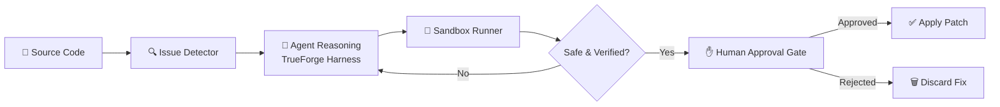

<div align="center">

# 🩹 PatchPilot

### *An AI agent that finds what's broken — and fixes it safely.*


<br/>

**Reach real systems. Run real code. Stop before it hurts.**

[Overview](#-overview) • [How It Works](#-how-it-works) • [Setup](#-setup) • [Safety](#-safety--guardrails) • [Team](#-team) • [Hackathon](#-hackathon-context)

</div>

---

## 🎯 Overview

**PatchPilot** is a deliberately imperfect demo repository built to showcase an AI agent that **detects code issues and safely proposes/applies fixes** — without ever taking an irreversible action without a human in the loop.

It isn't a toy chatbot bolted onto a codebase. It's an agent designed around one core idea:

> 🛑 **Autonomy is earned in stages — detect, propose, sandbox, confirm, act.**

| | |
|---|---|
| 🔍 **Detects** | Scans code for bugs, smells, and vulnerabilities |
| 🧠 **Reasons** | Plans a fix using an LLM-backed agent loop |
| 🧪 **Verifies** | Runs the proposed fix inside an isolated sandbox |
| ✋ **Pauses** | Stops before any irreversible change and asks for approval |
| ✅ **Applies** | Commits the fix only once a human says *go* |

---

## 🧩 Features

- 🩺 **Automated issue detection** across the codebase (`app.py`, tests, dependencies)
- 🤖 **Agentic reasoning loop** for generating and evaluating candidate fixes
- 📦 **Sandboxed execution** — generated code never touches production directly
- 🧯 **Human-in-the-loop guardrails** before any irreversible action
- 🔐 **Zero hardcoded secrets** — credentials are never committed
- 🧱 **Modular architecture** built for extension (new detectors, new fix strategies, new targets)

---

## 🏗️ Architecture



---

## ⚙️ Tech Stack

<div align="center">

| Layer | Tools |
|---|---|
| **Agent Harness** | TrueForge (`npx @truefoundry/trueforge`) |
| **Language** | Python 3.10+ |
| **Core App** | `app.py` |
| **Testing** | `pytest` (`tests/test_app.py`) |
| **Dependencies** | `requirements.txt` |
| **Execution** | Sandboxed runtime |

</div>

---

## 🔄 How It Works

1. **Scan** — PatchPilot walks the repo and flags issues (bugs, bad patterns, failing tests).
2. **Plan** — The agent reasons over the issue and drafts a candidate fix.
3. **Sandbox** — The candidate fix is executed in isolation — never against live/production paths.
4. **Gate** — Before anything irreversible (commit, deploy, delete), PatchPilot **stops and asks**.
5. **Act** — Once approved, the fix is applied and verified with tests.

---

## 🚀 Setup

```bash
# 1. Clone the repo
git clone https://github.com/krishsharma23032007/patchpilot-demo.git
cd patchpilot-demo

# 2. Install dependencies
pip install -r requirements.txt

# 3. Run the app
python app.py

# 4. Run tests
pytest tests/
```

> 💡 Requires **Python 3.10+**. No API keys are bundled — configure your own via environment variables before running.

---

## 📁 Project Structure

```
patchpilot-demo/
├── app.py                # Core application logic
├── requirements.txt      # Python dependencies
├── tests/
│   └── test_app.py       # Test suite
└── README.md             # You are here
```

---

## 🛡️ Safety & Guardrails

PatchPilot is built to satisfy a simple, non-negotiable rule set:

- ✅ Reaches a **real system or tool** — not a mock
- ✅ Runs all generated code **safely inside a sandbox**
- ✅ **Stops before irreversible actions** and waits for explicit human approval
- ✅ Never commits API keys, tokens, or credentials to the repo
- ✅ Participants/contributors retain full transparency into what the agent is doing at every step

---

## 🏆 Hackathon Context

Built for **[Agents That Act](https://hackculture.io/hackathons/agents-that-act)** — *TrueFoundry × Polaris*, hosted on **HackCulture**.

| | |
|---|---|
| 📅 **Event** | Sat, 26 Sep 2026 · Polaris School of Technology, Bengaluru |
| 🧰 **Harness** | TrueForge (open-source, MIT-licensed) |
| 💰 **Prize Pool** | ₹3,00,000 |
| ☁️ **Perks** | AWS + OpenAI credits for shortlisted teams |
| 🧭 **Challenge** | Build an agent that reaches real systems, runs real code, and knows when to stop |

---

## 👥 Team — `truecrew`

<div align="center">

| Name | Role |
|---|---|
| 👑 **Anish** | Team Lead |
| 💻 **Krish Sharma** | Contributor |
| 🎨 **Bhagyashree Patil** | Contributor |
| 🔧 **Charan A** | Contributor |

</div>

---

## 🤖 AI Disclosure

This project used AI coding assistants (Claude) during development, in line with hackathon disclosure rules. Team members can explain the full architecture and code.

---

## 📜 License

Released under the **MIT License** — see [LICENSE](LICENSE) for details.

<div align="center">

**Built with intent. Fixed with care. Stopped when it mattered.** 🩹

</div>
